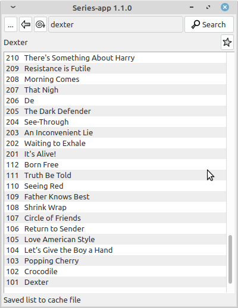

Series-app
==========
For your series
--------------------------------------

2011-2020 Gideon van der Kolf, noedigcode@gmail.com

Series-app is a small application that retrieves series and episode info from
epguides.com and allows the user to view and copy episode names to the clipboard
(in case you still need to manually rename an episode).



Episode dates are shown when hovering the mouse over an episode name and
yet unreleased episodes are marked grey.

The series and episode lists are cached so you don't have to re-download every time.

Double-clicking on an episode name copies the name and number to the clipboard.

A star button marks series as favourites for quick access.

Series-app is written in C++ using Qt5 and runs on Linux and Windows (and probably Mac OS too).

More of the same information is available at www.noedig.co.za/seriesapp/


Building:
---------

The app can easily be built by opening the .pro file with QtCreator and building.

To build from the Linux command line, run the following from the source code directory:
```
mkdir build
cd build
qmake ../seriesapp.pro
make
```
A `seriesapp` binary will be created.

